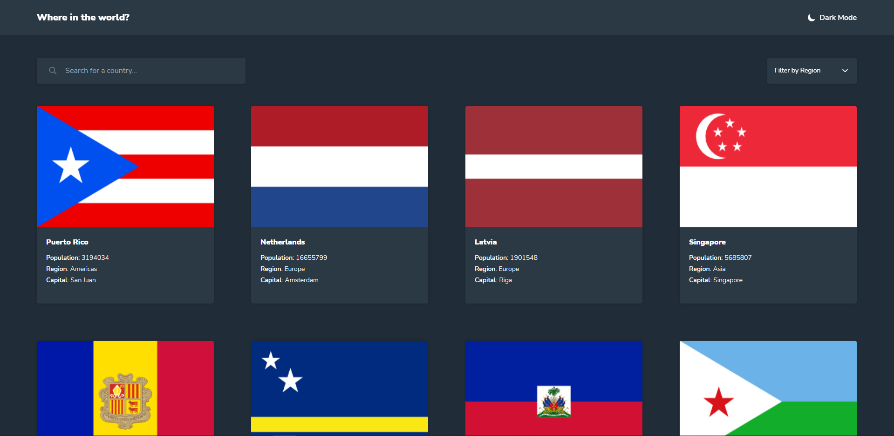
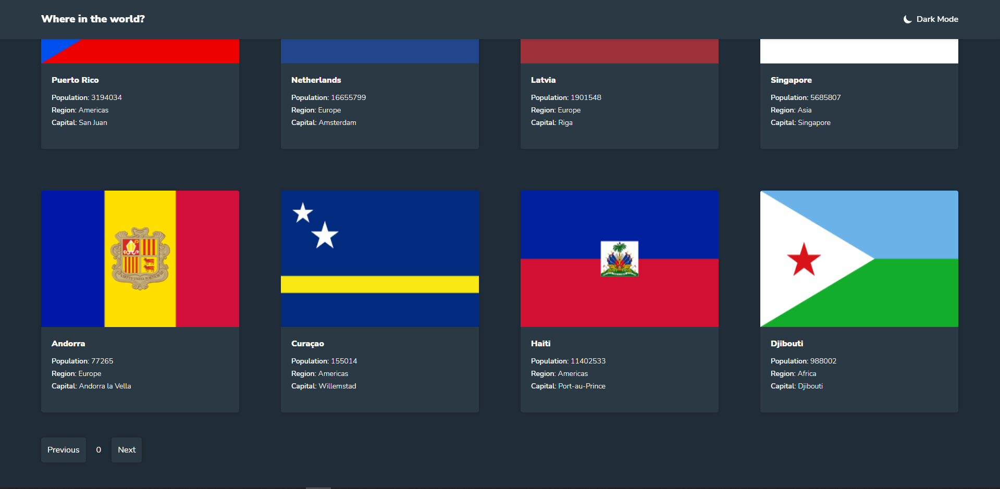
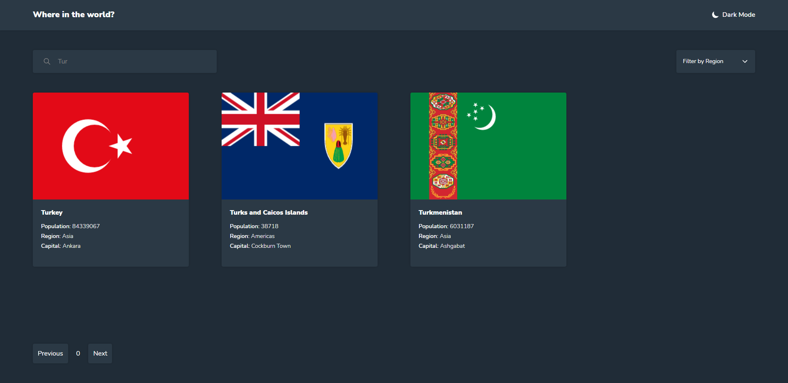
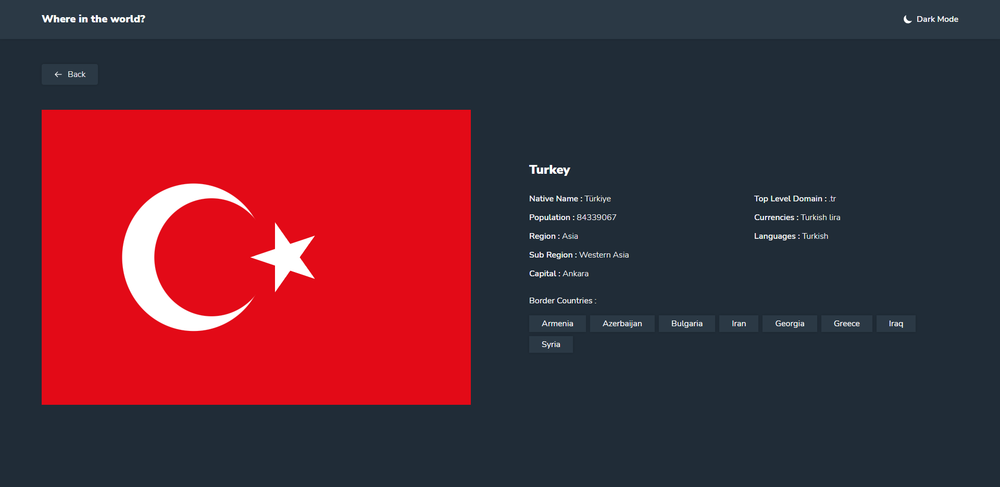
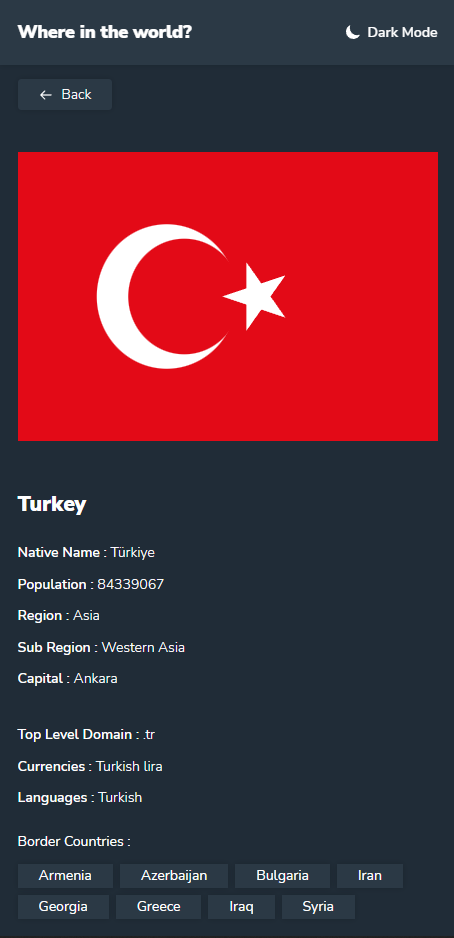
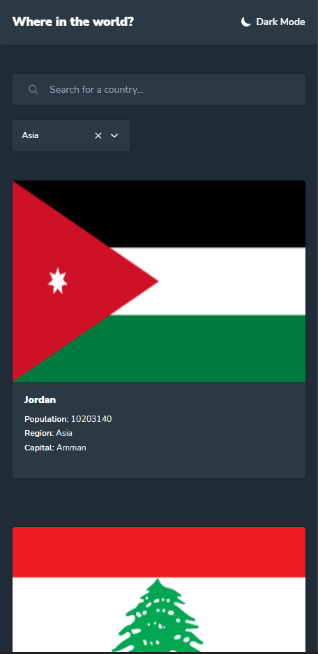

# Frontend Mentor - REST Countries API with color theme switcher solution

This is a solution to the [REST Countries API with color theme switcher challenge on Frontend Mentor](https://www.frontendmentor.io/challenges/rest-countries-api-with-color-theme-switcher-5cacc469fec04111f7b848ca). Frontend Mentor challenges help you improve your coding skills by building realistic projects. 

### Built with

- React
- TailwindCSS
- Typescript
- Axios
- Framer Motion
- Redux Toolkit
- React Icons

### Features

- Pagination
- Filter
- Search
- Responsive Design

## Demo

[Demo link](https://ersincakmak-countries-and-theme.netlify.app/)

## Screenshots

